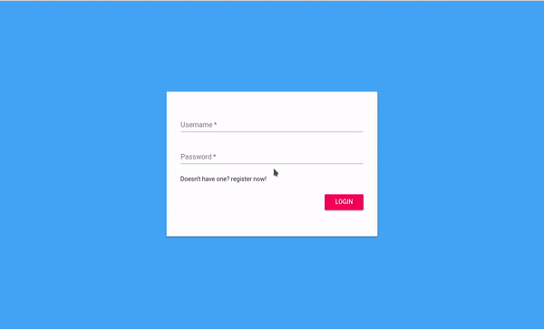

# React-Contacts

> A react project for beginners to learn programming with `react` `react-router` `redux`

## Quickly Start

```shell
npm install
npm start
```

## Main Dependencies

- `react`
- `react-router`
- `redux`
- `material-ui`


## Screenshot 



